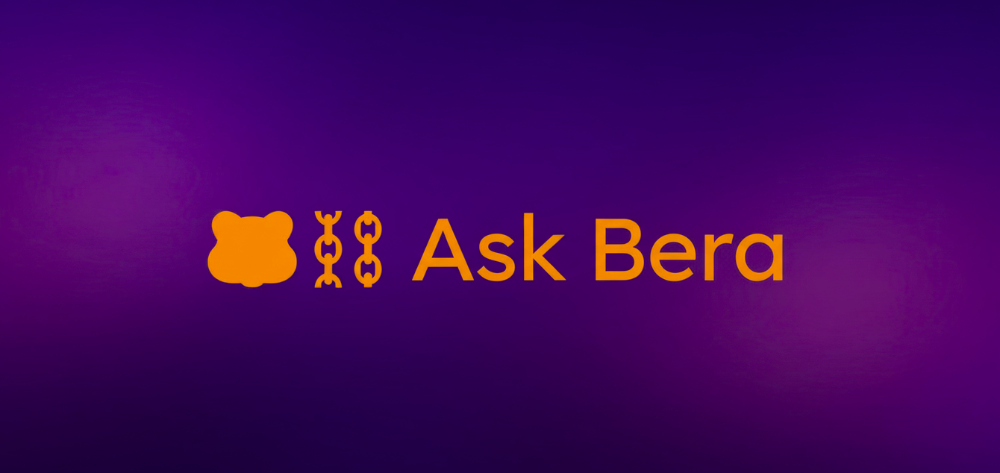

```markdown
<div align="center">
  
</div>

<div align="center">

[](https://smithery.ai/server/@SerPepe/bera-mcp)

</div>

# Bera MCP Server 🐻

**Your friendly bear companion for Berachain development!** 

Bera MCP is a powerful Model Context Protocol (MCP) server that gives AI agents instant access to the entire Berachain ecosystem. Built with RAG (Retrieval Augmented Generation), it's like having a knowledgeable bear by your side that never forgets where the honey is—or in this case, where all the documentation lives!

Whether you're building DeFi protocols, integrating oracles, or deploying smart contracts, Bera MCP helps you find answers faster than you can say "Honey!" 🍯

## What is Bera MCP?

Bera MCP is your go-to companion for all things Berachain. It's a smart documentation assistant that:

- **🐻 Roams the Berachain ecosystem**: Automatically indexes and keeps up-to-date with official Berachain docs and guides
- **🍯 Finds the sweetest answers**: Uses AI-powered semantic search to understand your questions and find the most relevant documentation
- **📚 Never forgets**: Stores everything in a vector database so it can recall information instantly
- **🔄 Stays fresh**: Automatically updates when new documentation is released

### What Can Bera Help You With?

Bera MCP has your back (and your front) when building on Berachain:

- 🏗️ **Smart Contract Development**: Get instant answers about contract patterns, best practices, and Berachain-specific features
- 💎 **DeFi Integrations**: Understand how to integrate with Berachain's DeFi protocols and token standards
- 🔮 **Oracle Integrations**: Learn how to use Pyth, Chainlink, and other oracles on Berachain
- 🚀 **Deployment Guides**: Step-by-step instructions for deploying and managing your contracts
- 🧪 **Testing & Debugging**: Best practices for testing your Berachain applications
- 📖 **API References**: Quick access to function signatures, parameters, and return values
- 🎯 **And everything else Berachain-related!**

Just ask Bera anything, and it'll dig through the documentation to find you the perfect answer!

## Features 🐻

Bera comes packed with powerful features to make your Berachain development journey smoother:

- **🐻 Wizard Tool (`ask_berachain`)**: Bera's superpower! Ask any question in plain English and get comprehensive, AI-powered answers with full code examples. It's like having a Berachain expert on speed dial!
- **🔍 Semantic Search (`search_docs`)**: Search across all documentation using natural language. No need to know exact keywords—just ask naturally!
- **📄 Document Retrieval (`get_doc_section`)**: Need a specific section? Bera knows exactly where everything is stored and can fetch it instantly.
- **🔄 Auto-Updates**: Bera stays up-to-date automatically! It watches the Berachain repos and indexes new documentation as it's released.
- **📚 Custom Docs**: Add your own markdown files to the `docs/` directory, and Bera will index them too. Perfect for team-specific guides or custom integrations!

## Prerequisites

- Node.js 18+ and npm
- OpenRouter API key (for embeddings and LLM)
- Upstash Vector account (for vector storage)

## Installation

### 1. Clone the Repository

```bash
git clone <your-repo-url>
cd bera-mcp
```

### 2. Install Dependencies

```bash
npm install
```

### 3. Set Up Environment Variables

Create a `.env` file in the root directory:

```env
OPENROUTER_API_KEY=your_openrouter_api_key_here
UPSTASH_VECTOR_REST_URL=your_upstash_vector_url_here
UPSTASH_VECTOR_REST_TOKEN=your_upstash_vector_token_here

LLM_MODEL=google/gemini-2.5-flash-preview-09-2025
```

**Required Environment Variables:**
- `OPENROUTER_API_KEY`: Your OpenRouter API key for embeddings and LLM generation
- `UPSTASH_VECTOR_REST_URL`: Your Upstash Vector REST API URL
- `UPSTASH_VECTOR_REST_TOKEN`: Your Upstash Vector REST API token

**Optional Environment Variables:**
- `LLM_MODEL`: LLM model for generating answers (default: `google/gemini-2.5-flash-preview-09-2025`)
- `CHUNK_SIZE`: Document chunk size for indexing (default: `1000`)
- `CHUNK_OVERLAP`: Overlap between chunks (default: `200`)
- `TOP_K`: Number of results for search (default: `5`)

### 4. Set Up Upstash Vector

1. Create an account at [Upstash](https://upstash.com/)
2. Create a new Vector database
3. Configure with these settings:
   - **Type**: `Dense`
   - **Embedding Model**: `Custom`
   - **Dimensions**: `3072`
   - **Metric**: `COSINE`
4. Copy the REST URL and Token to your `.env` file

### 5. Build and Index

```bash
npm run build
npm run index
```

The indexer will:
- Download Berachain docs and guides repositories
- Process all markdown files
- Generate embeddings
- Store everything in your Upstash Vector database

**Note**: First-time indexing may take 10-20 minutes depending on documentation size.

### 6. Start the Server

```bash
npm start
```

The server runs on stdio and is ready to accept MCP client connections.

## Installing in Cursor

Since Bera MCP uses your own API keys (OpenRouter and Upstash), you need to host it yourself. Here's how to set it up in Cursor:

### Option 1: Local Installation (Recommended)

1. **Clone and set up the server** (follow installation steps above)

2. **Add to Cursor's MCP settings** (`~/.cursor/mcp.json` or Cursor Settings → Features → Model Context Protocol):

```json
{
  "mcpServers": {
    "bera-mcp": {
      "command": "node",
      "args": ["/absolute/path/to/bera-mcp/dist/cli.js"],
      "env": {
        "OPENROUTER_API_KEY": "your_key_here",
        "UPSTASH_VECTOR_REST_URL": "your_url_here",
        "UPSTASH_VECTOR_REST_TOKEN": "your_token_here"
      }
    }
  }
}
```

3. **Restart Cursor** to load the MCP server

### Option 2: Deploy to Smithery (Recommended for Production)

Bera MCP is configured for Smithery deployment using TypeScript runtime. The `smithery.yaml` file is already set up.

1. **Push your repository to GitHub** (make sure `.env` is in `.gitignore`!)

2. **Deploy to Smithery**:
   - Go to [Smithery](https://smithery.ai/)
   - Sign in and connect your GitHub account
   - Click "Create Server" or "New Deployment"
   - Select your `bera-mcp` repository
   - Smithery will automatically detect the `smithery.yaml` configuration

3. **Configure Server Settings**:
   - In the Smithery dashboard, go to your server's settings
   - Add the following configuration values:
     - `openrouterApiKey`: Your OpenRouter API key
     - `upstashUrl`: Your Upstash Vector REST URL
     - `upstashToken`: Your Upstash Vector REST token
     - `llmModel`: Optional - LLM model name (default: `google/gemini-2.5-flash-preview-09-2025`)
   - These will be securely stored and passed to your server

4. **Deploy**:
   - Click "Deploy" in the Smithery dashboard
   - Smithery will build and deploy your server automatically
   - Wait for the deployment to complete (usually 2-5 minutes)

5. **Index Documentation** (First Time Only):
   - After deployment, you'll need to run the indexer once to populate the vector database
   - You can do this locally or set up a one-time indexing job
   - Run: `npm run index` (this requires your `.env` file with API keys)

6. **Connect from Cursor**:
   - In Cursor, go to Settings → Features → Model Context Protocol
   - Add a new MCP server using the Smithery connection URL
   - The URL format will be: `https://server.smithery.ai/your-server/mcp`
   - Configure with your API keys in the connection settings

**Note**: The server configuration schema is automatically generated from `configSchema` in `src/index.ts`, so Smithery will show a form for entering your API keys when connecting.

## MCP Tools

### `ask_berachain` 🐻

The main wizard tool for asking questions about Berachain development.

**Parameters:**
- `question` (required): Your question about Berachain
- `maxContextChunks` (optional): Number of document chunks to use (default: 5)

**Example:**
```json
{
  "question": "How do I integrate Pyth oracles on Berachain?",
  "maxContextChunks": 5
}
```

**Returns:** Comprehensive answer with code examples, sources, and citations.

### `search_docs` 🔍

Semantic search across all Berachain documentation.

**Parameters:**
- `query` (required): Search query
- `topK` (optional): Number of results (default: 5)

**Example:**
```json
{
  "query": "HONEY token oracle price",
  "topK": 3
}
```

**Returns:** Array of relevant document chunks with scores and metadata.

### `get_doc_section` 📄

Retrieve a specific documentation section by file path.

**Parameters:**
- `filePath` (required): Relative file path (e.g., `"PYTH_ORACLES_BERACHAIN.md"`)
- `repo` (required): Repository name (`"docs"`, `"guides"`, or `"local"`)

**Example:**
```json
{
  "filePath": "PYTH_ORACLES_BERACHAIN.md",
  "repo": "local"
}
```

**Returns:** All chunks from the specified file, sorted by order.

## Adding Custom Documentation

Place markdown files in the `docs/` directory. They will be automatically indexed on the next `npm run index` run.

**Example:**
```bash
mkdir -p docs
cp your-guide.md docs/
npm run index
```

## Updating Documentation

To update the indexed documentation:

```bash
npm run index
```

This will:
- Pull the latest changes from `berachain/docs` and `berachain/guides`
- Re-index all documentation
- Update your vector database

## Project Structure

```
bera-mcp/
├── src/
│   ├── cli.ts              # MCP server entry point
│   ├── server.ts           # MCP server setup
│   ├── config.ts           # Configuration management
│   ├── indexer.ts          # Indexing pipeline
│   ├── indexer-cli.ts      # CLI for indexing
│   ├── downloader.ts      # Git repository downloader
│   ├── processor.ts        # Markdown processing and chunking
│   ├── embeddings.ts       # Embedding generation
│   ├── vectorStore.ts      # Upstash Vector integration
│   └── tools/
│       ├── query.ts         # ask_berachain wizard tool
│       └── search.ts        # search_docs and get_doc_section tools
├── docs/                    # Custom documentation (auto-indexed)
├── data/                    # Downloaded repositories (gitignored)
├── dist/                    # Compiled output (gitignored)
└── .env                     # Environment variables (gitignored)
```

## Security Notes

⚠️ **Important**: Never commit your `.env` file or API keys to version control!

The `.gitignore` file is configured to exclude:
- `.env` and all environment files
- `data/` directory (downloaded repos)
- `node_modules/`
- `dist/` (compiled code)

Always use environment variables or secure secret management when deploying.

## Troubleshooting

### "OPENROUTER_API_KEY environment variable is required"

Make sure your `.env` file exists and contains `OPENROUTER_API_KEY`.

### "UPSTASH_VECTOR_REST_URL and UPSTASH_VECTOR_REST_TOKEN environment variables are required"

Set up your Upstash Vector database and add the credentials to `.env`.

### Indexing fails or takes too long

- Check your OpenRouter API key has sufficient credits
- Verify your Upstash Vector database is accessible
- Check network connectivity for downloading repositories

### MCP server not connecting in Cursor

- Verify the path in `mcp.json` is absolute and correct
- Check that `npm run build` completed successfully
- Ensure environment variables are set in Cursor's MCP configuration
- Restart Cursor after configuration changes

## License

MIT

## Contributing

Contributions welcome! Please ensure:
- All code is properly typed (TypeScript)
- Environment variables are documented
- Security best practices are followed
- Tests are added for new features

## Support

Got questions? Stuck on something? Bera's here to help! 

- 🐛 **Found a bug?** Open an issue on GitHub
- 💡 **Have an idea?** We'd love to hear it!
- 🤝 **Want to contribute?** Pull requests are always welcome!

---

**Built with 🍯 for the Berachain developer community** 🐻

*May your contracts deploy smoothly and your honey flow freely!*
```